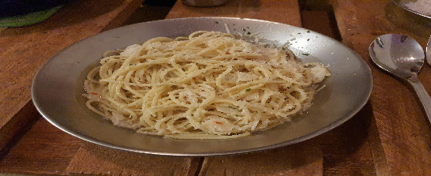

- [ ] 3 rkl oliiviöljyä  
- [ ] 6 kynttä valkosipulia  
- [ ] ¼ tl chilihiutaleita  
- [ ] ½ tl persiljaa  
- [ ] 2 annosta spagettia  
- [ ] 2 tl suolaa (pastaveteen)  
- [ ] 1 ½  litraa vettä  
- [ ] raastettua parmesania

1. Lisää suola keitinveteen ja aloita pastan keittäminen.  
2. Leikkaa valkosipuli ohuiksi siivuiksi.  
3. Lämmitä pannulla keskilämmöllä 2 rkl oliiviöljyä.  
4. Lisää pannulle valkosipuli ja chilihiutaleet, paista kunnes valkosipuli ruskistuu hieman.  
5. Kun pasta on valmis, siivilöi se mutta säästä 2 dl pastan keitinvettä.  
6. Lisää keitinvesi pannulle ja kiehuta sitä kunnes nesteen määrä on puolittunut.  
7. Lisää keitetty, hieman kuivahtanut pasta pannulle ja lisää 1 rkl öljyä ja persilja.  
8. Tarjoile raastetun parmesanin kanssa.