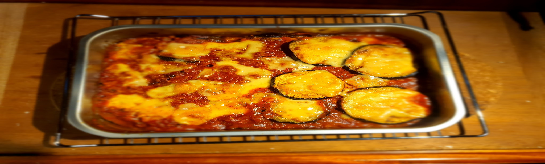

 

- [ ] 1 munakoiso  
- [ ] voita  
- [ ] 1 rkl oliiviöljyä  
- [ ] 1 sipuli  
- [ ] 2 valkosipulin kynttä  
- [ ] ½ rkl basilikaa  
- [ ] ½ rkl oregano  
- [ ] ½ rkl timjami  
- [ ] 1 laakerinlehti  
- [ ] 1 tl chilihiutaleita  
- [ ] 150 ml soijarouhetta  
- [ ] 2 rkl soijakastiketta  
- [ ] 150 ml kasvilientä   
- [ ] 70 g tomaattipyrettä  
- [ ] 400 g tomaattimurskaa

1. Leikkaa munakoisot 1 cm:n paksuisiksi viipaleiksi. Paista niihin kauniin ruskea pinta pannulla rasvassa. Ripottele pinnalle suolaa. Nosta ne uunivuokaan odottamaan.  
2. Lämmitä keskilämmöllä isolla pannulla oliiviöljyä. Lisää pilkottu sipuli anna hautua noin 5 minuuttia kunnes sipuli alkaa pehmetä.
3. Lisää kuivat italialaiset mausteet ja chilihiutaleet pannulle. Jos seos näyttää kuivalta, lisää hieman oliiviöljyä. Sekoita murskattu valkosipuli joukkoon hyvin sekoittaen..
4. Lisää kuiva soijarouhe ja sekoita tasaiseksi sipulin, porkkanoiden ja mausteiden kera. Lisää soijakastike ja sekoita.
5. Lisää kasvisliemi pannulle. Anna kiehua muutama minuutti.
6. Lisää tommattipyre ja sekoita kunnolla.
7. Lisää tomaattimurska ja sekoita. 
8. Laita uunivuokaan kerroksittain munakoisoviipaleita ja tomaattikastiketta. Ripottele pinnalle juustoraaste.
9. Kypsennä paistosta uunissa 225 asteessa 20 \- 25 min.