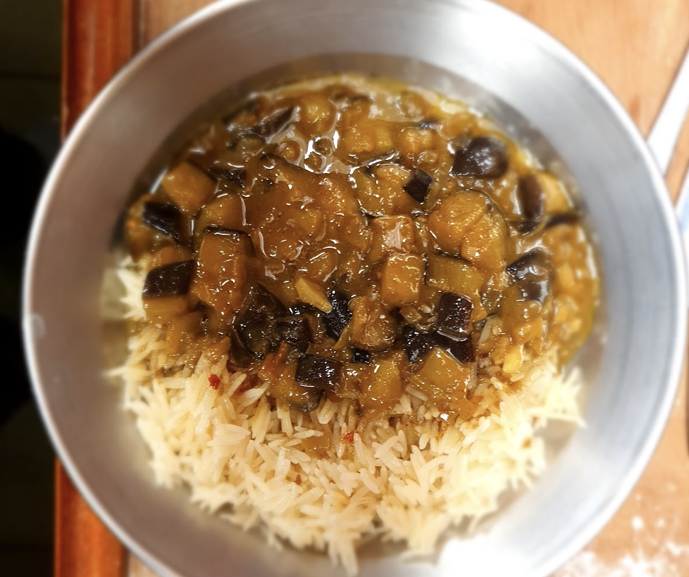

 

- [ ] 1 munakoiso  
- [ ] 1/2dl soijakastiketta
- [ ] 1/2dl ruskeaa sokeria  
- [ ] 1 valkosipulia
- [ ] 5cm tuoretta inkivääriä (raastettuna)
- [ ] 1tl srirachaa  
- [ ] 2rkl oliiviöljyä  
- [ ] 1dl cashew tai maapähkinöitä

1. Leikkaa munakoiso noin 1cm kuutioiksi  
2. Paista munakoisoa pannulla oliiviöljyssä kunnes palat ovat pehmeitä  
3. Sekoita soijakastike, sokeri, valkosipuli, inkivääri ja sriracha keskenään  
4. Kaada glaseeraus pannulle, sekoita niin että munakoiso pinnoittuu hyvin  
5. Paista noin 5min. Lisää pähkinät viimeisen parin minuutin aikana  
6. Tarjoile riisin ja esimerkiksi sriracha-majoneesin kera