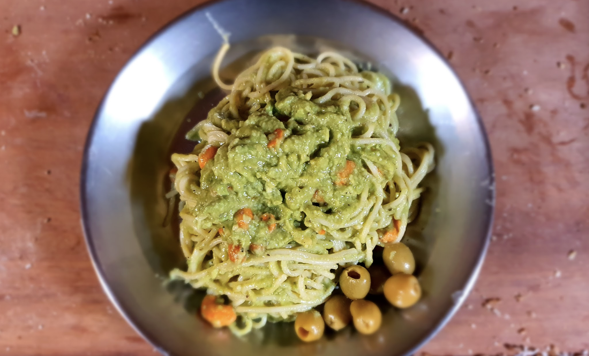

- [ ] 2 annosta spagettia  
- [ ] 1 avokado (iso)
- [ ] 2 kynttä valkosipulia  
- [ ] ½ dl pähkinöitä  
- [ ] 3 rkl oliiviöljyä  
- [ ] 1.5 dl parmesania (raastettua)
- [ ] 2 tl basilikaa  
- [ ] 1 rkl sitruunamehua  
- [ ] ½ tl suolaa  
- [ ] 1 tl mustapippuria  
- [ ] ½ dl pastan keitinlientä  
- [ ] 2 tl suolaa (pastaveteen)  
- [ ] 1 ½  litraa vettä

1. Lisää suola keitinveteen ja aloita pastan keittäminen.  
2. Halkaise, poista siemen ja koverra avokadon hedelmäliha kuorestaan. Soseuta avokado karkeasti haarukalla.  
3.  Hienonna valkosipulinkynsi veitsellä.  
4. Sekoita avokado, valkosipuli, pähkinät, parmesaani, basilika, öljy, sitruunanmehu ja mausteet keskenään. Seokseen saa jäädä sattumia.  
5. Valuta pasta, mutta ota talteen hieman keitinlientä. Sekoita keitinliemi avokadoseoksen joukkoon ja yhdistä seos pastaan. Tarkista maku. Lisää suolaa ja pippuria tarvittaessa.   
6. Tarjoa lisäksi parmesaania