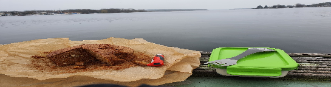

 

- [ ] 2  (200g) banaania  
- [ ] 1 rkl sitruunamehua  
- [ ] 100 g voita  
- [ ] 1.5 dl sokeria  
- [ ] 1 kananmunaa  
- [ ] 2 dl vehnäjauhoja  
- [ ] 1 tl leivinjauhetta  
- [ ] 1 tl kanelia  
- [ ] 1 tl inkivääriä

1. Voitele ja korppujauhota kakkuvuoka (tilavuus 1,8 l).
2. Soseuta banaanit haarukalla. Sekoita sitruunanmehu banaanisoseen joukkoon.
3. Vatkaa pehmeä margariini ja sokeri vaaleaksi vaahdoksi. Lisää munat yksitellen vaahdon joukkoon hyvin vatkaten. Sekoita kuivat aineet keskenään. Sekoita jauhoseos vuorotellen banaanisoseen kanssa vaahdon joukkoon.  
4. Paista 175-asteisen uunin alimmalla tasolla noin tunti. Kumoa kakku hieman jäähtyneenä. Tarjoa kahvin kanssa.