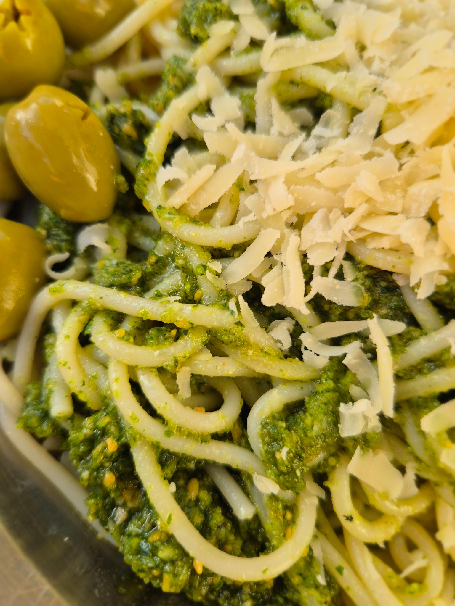

- [ ] 2dl tuoretta basilikaa (tiiviisti pakattuna)
- [ ] 1dl cashew pähkinöitä
- [ ] 1 dl oliiviöljyä
- [ ] 2 kynttä valkosipulia
- [ ] 1/2 tl suolaa
- [ ] 1/2 tl mustapippuria
- [ ] 2rkl ravintohiivaa tai parmesania

1. Aloita pastan keittäminen
2. Laita ainekset astiaan
3. Soseuta sauvasekoittimella
4. Sekoita valmiiseen pastaan ja tarjoile
