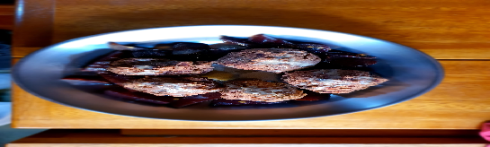

- [ ] 400g raakaa punajuurta  
- [ ] 200g  keitettyjä perunaa  
- [ ] 1 dl maissia  
- [ ] 3 rkl graham tai tattarijauhoa  
- [ ] 1 tl basilikaa  
- [ ] 2 rkl rypsiöljyä paistamiseen

1. Kuori keitetyt perunat ja raa-at punajuuret  
2. Raasta ne hienoksi raasteeksi  
3. Sekoita kaikki ainekset tasaiseksi taikinaksi  
4. Muotoile taikinasta pötkä ja jaa se 24 osaan  
5. Pyörittele niistä palloja  
6. Paista miedolla lämmöllä välillä käännellen noin 20 minuuttia