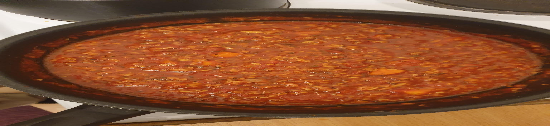

- [ ] 1 rkl oliiviöljyä  
- [ ] 1 sipuli  
- [ ] 2 porkkanaa  
- [ ] 2 kynttä valkosipulia  
- [ ] ½ rkl basilikaa  
- [ ] ½ rkl oreganoa  
- [ ] ½ rkl timjamia
- [ ] laakerinlehti  
- [ ] 1 tl chilihiutaleita  
- [ ] 150 ml soijarouhetta  
- [ ] 2 rkl soijakastiketta  
- [ ] 150 ml kasvislientä   
- [ ] 2rkl kuivattua paprikaa  
- [ ] 70 g tomaattipyrettä  
- [ ] 400 g tomaattimurskaa
- [ ] 2 annosta spagettia  
- [ ] 1 tl suolaa (pastaveteen)  
- [ ] 1 litraa vettä  
- [ ] raastettua parmesania  
- [ ] valkoviiniä

1. Pilko sipuli ja porkkana.  
2. Laita pannulle oliiviöljyä ja paista sipulia ja porkkanaa noin 5 minuuttia kunnes sipulit ovat läpikuultavia.
3. Lisää kuivat italialaiset mausteet ja chilihiutaleet pannulle. Jos seos näyttää kuivalta, lisää hieman oliiviöljyä. Sekoita murskattu valkosipuli joukkoon hyvin sekoittaen..
4. Lisää kuiva soijarouhe ja sekoita tasaiseksi sipulin, porkkanoiden ja mausteiden kera. Lisää soijakastike ja sekoita.
5. Lisää kasvisliemi pannulle. Anna kiehua muutama minuutti.
6. Lisää tommattipyre ja sekoita kunnolla.
7. Lisää tomaattimurska ja sekoita. Kun seos alkaa kiehua, alenna levyn lämpötila miedolle ja anna kastikkeen hautua 7-9 minuuttia. Haudutuksen aikana kastikkeeseen voi lisätä viiniä makua antamaan.
 
  Tomaattimurskan sijaan voi käyttää 1.5dl kuivattua tomaattia liotettuna.