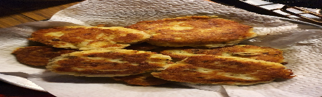

- [ ] 5–6 keitettyä perunaa  
- [ ] 50–100 g pecorinoa  
- [ ] 1tl tuoretta persiljaa  
- [ ] 1tl tuoretta basilikaa  
- [ ] 2 kananmunaa  
- [ ] öljyä paistamiseen

1. Soseuta keitetyt perunat.  
2. Raasta pecorino hienoksi.  
3. Silppua persilja ja revi basilikanlehdet pieniksi paloiksi.  
4. Sekoita kaikki ainekset kiinteäksi massaksi.  
5. Muotoile massasta pieniä pihvejä. Paista ne kullankeltaisiksi öljyssä paistinpannulla keskilämmöllä.  
6. Nosta valmiit pihvit talouspaperin päälle vadille.  
7. Tarjoa ne haaleina salaatin tai oliivien kera. Kylminä ne sopivat myös välipalaksi.