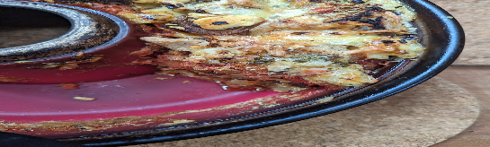

- [ ] Kuiva leipä  
- [ ] Sipuli  
- [ ] 400g murskattua tomaattia  
- [ ] Juustoa  
- [ ] Sieniä  
- [ ] Aurinkokuivattu tomaatti  
- [ ] Maitoa  
- [ ] Munaa  
- [ ] Mustapippuri  
- [ ] Oregano  
- [ ] Ruohosipuli

1. Liota sienet  
2. Pilko kuiva leipä ohuiksi siivuiksi ja kuutioiksi  
3. Pilko sipuli  
4. Raasta juusto  
5. Pilko aurinkokuivatut tomaatit  
6. Riko munat ja sekoita munamaito  
7. Lisää mausteet munamaitoon  
8. Lado kerros leipää uunivuuan pohjalle  
9. Laita päälle pilkottu sipuli, puolet raastetusta juustosta, sienet, aurinkokuivattu tomaatti ja tomaattimurska  
10. Ripottele päälle kerros leipäkuutioita.  
11. Kaada päälle munamaitomausteseos.  
12. Ripottle juusto päällimmäiseksi  
13. Paista uunissa noin kahdessasadassa asteessa 45 minuuttia