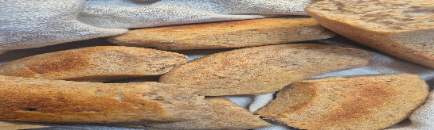

1. Lämmitä neste 42-asteiseksi.  
2. Sekoita kuivahiiva pieneen määrään jauhoja ja lisää veteen.  
3. Lisää hunaja tai siirappi ja suola.   
4. Alusta taikinaan vähitellen loput jauhoista ja lisää öljy alustamisen loppuvaiheessa. Taikina saa olla pehmeää.  
5. Kohota taikinaa kulhossa liinan alla 20–30 minuuttia.  
6. Leivo taikinasta 50 cm pitkä pötkö ja leikkaa se noin 12 palaan.   
7. Nosta sämpylät pellille leivinpaperin päälle ja kohota vielä noin 20 minuuttia.  
8. Paista Omniassa 225 asteessa noin 10 \+ 10 minuuttia.