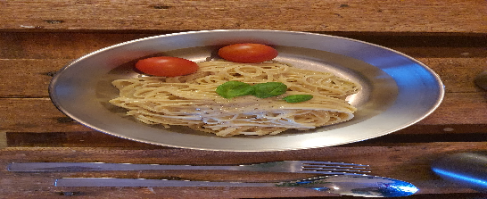

- [ ] 1 rkl oliiviöljyä  
- [ ] 1 rkl voita  
- [ ] 2 tl mustapippuria (isorakeinen)  
- [ ] 2 dl parmesania tai grada padanoa (raastettuna)
- [ ] 1 dl pecorinoa (raastettua)
- [ ] 2 annosta spagettia  
- [ ] 2 tl suolaa (pastaveteen)  
- [ ] 1 ½  litraa vettä

1. Lisää suola keitinveteen ja aloita pastan keittäminen.  
2. Raasta juustot.  
3. Lämmitä pippuria pannulla keskilämmöllä.  
4. Lisää pannulle pari kauhallista pastan keittovettä  
5. Lisää öljy ja voi pannulle ja sekoita  
6. Kun pasta on melkein valmis, siivilöi se   
7. Lisää keitetty pasta pannulle, lisää juustot ja sekoita.