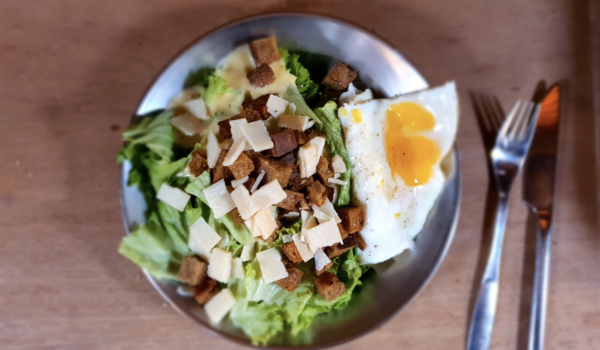

 

- [ ] 2 kynttä valkosipulia  
- [ ] 1 tl suolaa  
- [ ] 2 kananmunan keltuaista  
- [ ] 2 rkl sitruunamehua  
- [ ] ¾ tl dijon sinappia  
- [ ] 2 rkl oliiviöljyä  
- [ ] 1 ½ dl rypsiöljyä  
- [ ] 3 rkl hienoksi raastettua parmesania  
- [ ] mustapippuria  
- [ ] salaattia  
- [ ] krutonkeja

1. Sekoita muskattu valkosipuli ja suola tahnaksi  
2. Sekoita joukkoon kananmunankeltuaiset, sinappi ja sitruunamehu  
3. Sekoita oliiviöljy ja ruokaöljy joukkoon varovasti hyvin sekoittaen  
4. Sekoita joukkoon parmesan  
5. Lisää mustapippuri  
6. Pese salaatti ja revi suupalan kokoisiksi paloiksi  
7. Tarjoile paistetun kananmunan ja krutonkien kanssa