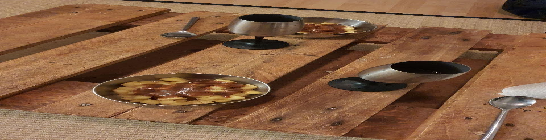

- [ ] 3 rkl voita  
- [ ] 5 omenaa  
- [ ] 3 rkl sokeria  
- [ ] ½ tl kanelia  
- [ ] 3 ml sitruunamehua  
- [ ] 1 dl siideriä

1. Sulata voi keskilämmöllä pannussa.  
2. Lisää pilkottu omena ja sirottele joukkoon 1 rkl sokeria.  
3. Hauduta omenia pannulla 6-8min kunnes ne alkavat hieman pehmetä.  
4. Sirottele pannulle loput sokerista, kaneli ja sitruunamehu. Hauduta vielä kaksi minuuttia kunnes sokeri alkaa karamellisoitua.  
5. Siirrä omenat sekoituslastalla kulhoon odottamaan.  
6. Nosta levyn lämpö kovaksi ja kaada siideri pannulle. Sekoita pannulla olevat sokerin ja kanelinjämät siiderin kanssa ja kiehuta siideriä 1-3 minuuttia kunnes kastike on keittynyt kokoon hieman.  
7. Kaada valmis kastike omenoiden päälle ja tarjoile.