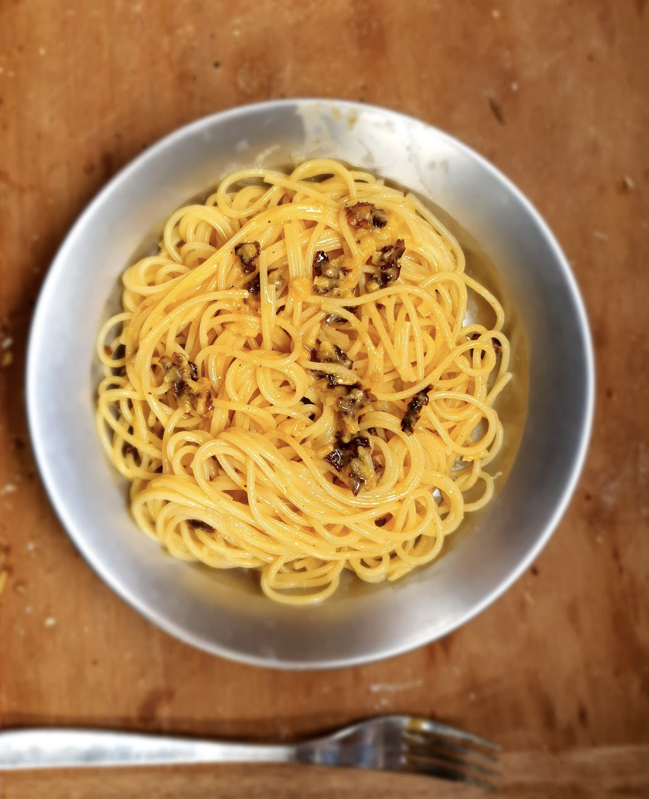

- [ ] 4 munaa
- [ ] 100g parmesania tai pecorinoa
- [ ] 2tl mustapippuria

1. Keitä spaghetti, ota 1dl keitinvettä talteen
2. Riko munat
3. Raasta juusto
4. Sekoita munat, juusto, ja mustapippuri
5. Sekoita keitinvesi kastikkeeseen
6. Sekoita kastike ja spaghetti keskenään

Kastikkeeseen voi lisätä paistettuja aurinkokuivattuja tomaatteja.