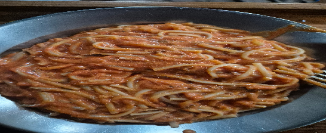

- [ ] 2 annosta spagettia  
- [ ] 400g tomaattimurskaa
- [ ] 1 dl cashew-pähkinöitä  
- [ ] 1 rkl tomaattipyrettä  
- [ ] 1 rkl oliiviöljyä  
- [ ] 2 kynttä valkosipulia
- [ ] 1 dl kuivattuja sieniä
- [ ] 1 tl balsamicoa  
- [ ] 1 dl vettä  
- [ ] tuoretta basilikaa  
- [ ] suolaa
- [ ] mustapippuria  
- [ ] 2 tl suolaa (pastaveteen)  
- [ ] 1 ½  litraa vettä

1. Liota sienet 30 min  
2. Laita sienet liotusvesineen pannulle ja paista kuivaksi.  
3. Soseuta sauvasekoittimella tomaatit, cashewpähkinät, tomaattipyree ja 1 rkl oliiviöljyä mahdollisimman sileäksi seokseksi.  
4. Lisää pilkottu valkosipuli, balsamico ja oliiviöljy ja paista muutama minuutti  
5. Laita pasta kiehumaan.  
6. Lisää pannulle tomaatti-cashewseos sekä osa vedestä. Kypsennä keskilämmöllä 4–5 minuuttia, lisää pannulle vettä hiljalleen. Lisää vettä, kunnes kastikkeen koostumus on sopiva. Mausta suolalla ja pippurilla.  
7. Sekoita kastike keitetyn, valutetun pastan joukkoon ja silppua sekaan reilusti tuoretta basilikaa.