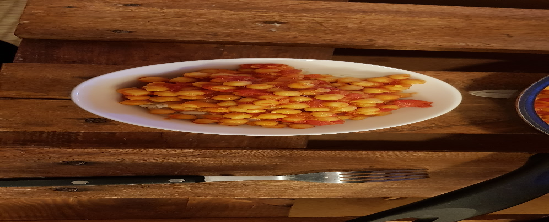

 

- [ ] 1 rkl oliiviöljyä  
- [ ] 1 sipuli, pilkottuna  
- [ ] 2 kynttä valkosipulia, murskattuna  
- [ ] 2.5dl keitettyjä kikherneitä  
- [ ] 200g murskattuja tomaatteja  
- [ ] 1dl vettä  
- [ ] 2 tl curryjauhetta  
- [ ] 1 tl garam Masala  
- [ ] ½ tl inkiväärijauhetta  
- [ ] ½ tl chilijauhetta  
- [ ] 1 tl sitruunamehua

1. Keitä sipulia ja valkosipulia oliiviöljyssä kunnes sipuli on läpikuultavaa  
2. Lisää mausteet ja paista hetki  
3. Lisää kikherneet, tomaatti ja vesi. Sekoita ja anna kiehahtaa  
4. Anna hautua välillä sekoittaen kunnes kastike on halutun paksuista (noin 20min)  
5. Lisää sitruunamehua ja sekoita  
6. Tarjoile riisin kera