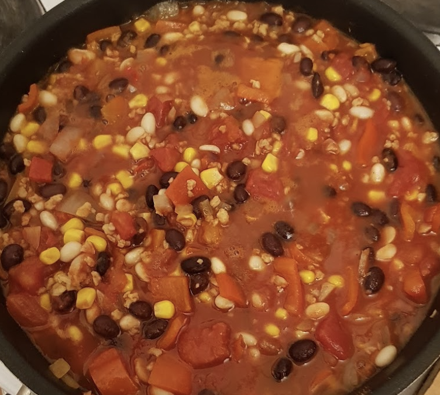

 

- [ ] 2 rkl rypsiöljyä  
- [ ] 1 sipuli  
- [ ] 2 kynttä valkosipulia  
- [ ] 2 porkkanaa  
- [ ] 1 rkl chilijauhetta  
- [ ] 1 tl kuminaa  
- [ ] 1 tl korianteria  
- [ ] 1 tl oreganoa  
- [ ] ½ tl chilihiutaleita  
- [ ] laakerinlehti  
- [ ] 3 dl kuivattuja papuja  
- [ ] 1 dl soijarouhetta  
- [ ] 1 dl kasvislientä  
- [ ] 1 rkl soijakastiketta  
- [ ] 400g tomaattimurskaa  
- [ ] 100 g maissia  
- [ ] suolaa  
- [ ] mustapippuria 

1. Esikeitä liotetut pavut kypsiksi  
2. Hauduta pilkotut sipulit ja porkkanat öljyssä, kunnes ne ovat pehmenneet  
3. Lisää suola, valkosipuli ja mausteet ja hauduta hetki  
4. Lisää soijarouhe ja soijakastike, anna hautua hetki  
5. Lisää kasvisliemi  
6. Lisää pavut , tomaatit ja maissi. Anna chilin kiehua noin tunti  
7. Tarjoile maissilastujen kera