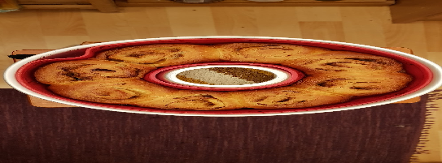

 

- [ ] 1 ½ dl / 150g vettä  
- [ ] ½ dl / 30g maitojauhetta  
- [ ] 60 g [ruisjuurta](sourdough.md)  
- [ ] ½ muna  
- [ ] ½ dl / 44g sokeri  
- [ ] ½ tl / 1g suolaa  
- [ ] 1 tl / 2g kardemummaa  
- [ ] 5dl / 310g vehnäjauhoja  
- [ ] 50g voita  
Täyte:
- [ ] Voi
- [ ] Fariinisokeri
- [ ] Kaneli

1. Sekoita maitojauhe kylmään veteen  
2. Lisää muna, sokeri, mausteet ja osa jauhoista (noin 200g)  
3. Lisää sulatettu ja hieman jäähtynyt voi   
4. Vaivaa taikinaa ja lisää loput jauhoista  
5. Peitä kulho kelmulla ja anna taikinan tekeytyä ja kohota lämpimässä paikassa noin 2 tuntia. Taikinan ei kuulu kovin paljon nousta tänä aikana, vaan se tekeytyy ja juuren hiivat aloittavat työnsä.  
6. Kumoa taikina työpöydälle ja vaivaa sitä hetki.  
7. Jos teet korvapuusteja, niin kauli taikina levyksi (25 cm x 35 cm). Levitä päälle huoneenlämpöinen voi, ripottele sokeri ja kaneli, kääri rullalle ja leikkaa paloiksi. Nosta omnia vuokaan.  
8. Peitä pelti liinalla ja nosta uuniin, jossa on päällä vain valo. Anna pullien kohota 3–5 tuntia.  
9. Kun pullat ovat kohonneet hyvin, voitele munalla.  
10. Kauli taikina levyksi  
11. Levitä levylle voi, fariinisokeri ja kaneli  
12. Rullaa taikinalevy ja leikkaa se palasiksi  
13. Voitele pullat munan jäljelläolevalla puolikkaalla  
14. Paista noin 30 minuuttia 200 asteisessa uunissa