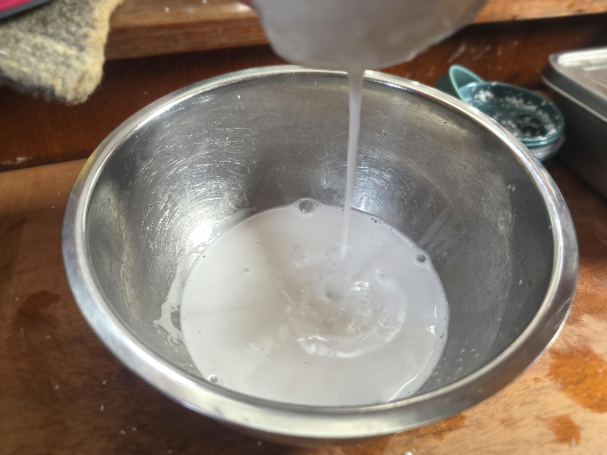

- [ ] 1 kookospähkinä
- [ ] 4 x 2dl vettä

1. Pilko kookosliha paloiksi
2. Laita blenderiin 4 dl kookoslihaa
3. Lisää 2dl vettä
4. Sekoita noin 30 sek
5. Valuta juustokankaan läpi.
6. Kaada juustokankaan sisällä olevat purut uudestaan blenderiin.
7. Lisää 2 dl vettä
8. Sekoita noin 30 sek ajan
9. Valuta juustokankaan läpi.
10. Purut voi tämän jälkeen laittaa jääkaappiin ja käyttää leivontaan.
11. Toista kunnes kookosliha on käytetty
