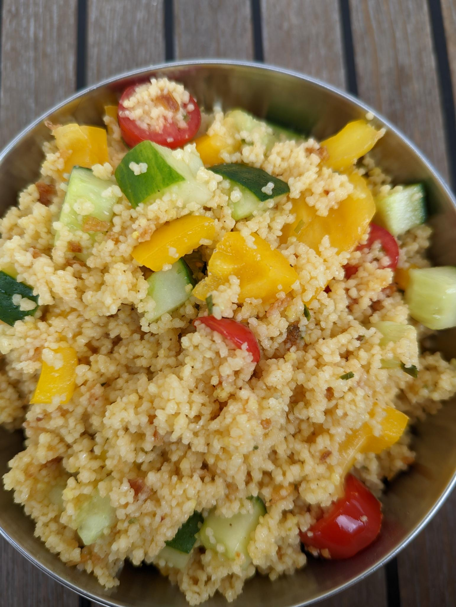

 

- [ ] 2 dl kasvislientä  
- [ ] 1 ¾ dl cous cousia 
- [ ] 1 rkl  sitruunamehua  
- [ ] 3 rkl oliiviöljyä  
- [ ] 1 sipuli tai paistettua sipulia 
- [ ] 3-4 tomaattia  
- [ ] 10 cm kurkkua  
- [ ] puolikas paprika  
- [ ] ½ tl suolaa  
- [ ] ½ tl mustapippuria

1. Keitä vesi ja liota kasvisliemi  
2. Liesi pois päältä  
3. Lisää cous cous, sekoita ja kannen alle hautumaan 10 minuutiksi  
4. Fluffaa cous cous  
5. Pilko sipuli, kurkku ja tomaatti ja paprika pieniksi kuutioiksi  
6. lisää oliiviöljy, sitruunamehu, pippuri, suola ja sekoita