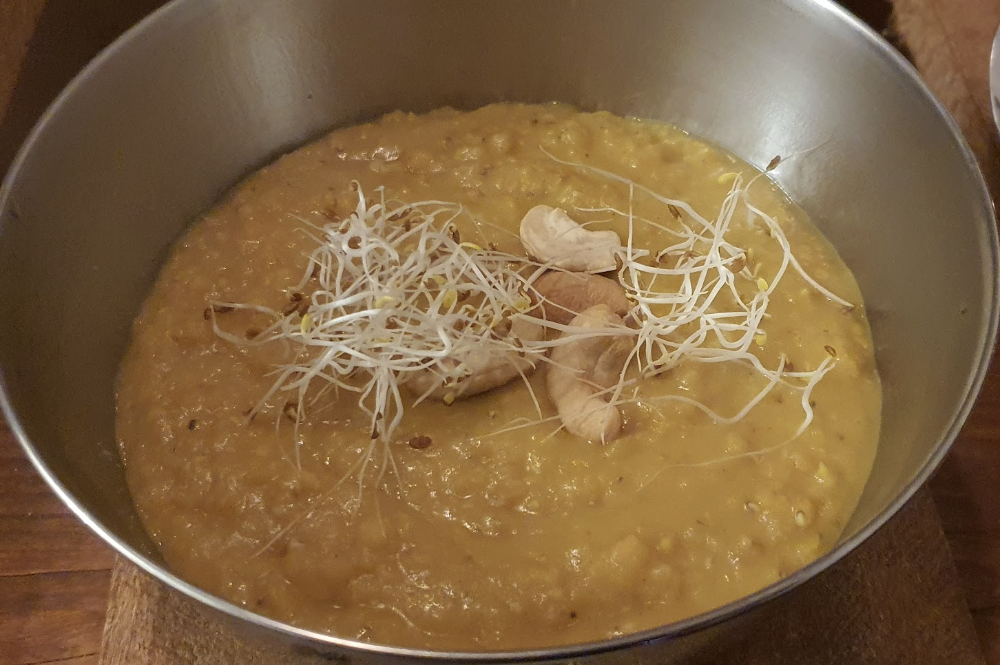

- [ ] 1 rkl kookosöljyä  
- [ ] 1 sipuli  
- [ ] 4 kynttä valkosipulia  
- [ ] 2cm tuoretta inkivääriä  
- [ ] 0.8 l kasvislientä  
- [ ] 3.5dl punaisia linssejä  
- [ ] 1 tl curryjauhetta
- [ ] 1 tl kuminaa  
- [ ] 1 tl korianteria
- [ ] ½ tl garam masalaa  
- [ ] ½ tl suolaa  
- [ ] 400g tomaattimurskaa

1. Paista kattilassa keskilämmöllä sipulia kunnes läpikuultavia.  
2. Lisää valkosipuli ja inkivääri ja keitä noin minuutti  
3. Lisää mausteet kattilaan ja paista noin 30 sekunnin ajan.  
4. Lisää kasvisliemi, linssit, ja tomaatit  
5. Paineista kattila ja vaihda levy miedolle lämmölle ja keitä soppaa 15 minuutin ajan  
6. Ota kattila liedeltä ja anna paineen laskeutua kattilassa kantta avaamatta.