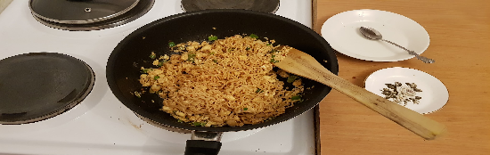

 

- [ ] 50g voita  
- [ ] ½ rkl chilihiutaleita
- [ ] 2 munaa  
- [ ] 2 rkl ruskeaa sokeria
- [ ] 2 rkl sriracha a
- [ ] 2 rkl soijakastiketta
- [ ] 1-2 kevätsipulia
- [ ] Kaksi annosta nuudelia

1. Keitä nuudelit ohjeiden mukaan (tyypillisesti 5-7min)
2. Sekoita soijakastike, sriracha, ja sokeri
3. Sulata voita pannulla ja lisää chilihiutaleet
4. Riko munat ja paista kokkeliksi pannulla. Lisää kevätsipuli 
5. Beat the eggs and scramble them and the spring onion in butter.  
6. Valuta nuudelit. Lisää nuudelit ja kastike pannulle ja sekoita