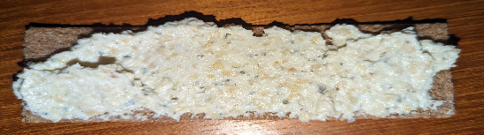

 

- [ ] 200 g fetajuustoa  
- [ ] 150 g cashew pähkinöitä   
- [ ] 1 kynsi valkosipulia
- [ ] 3 rkl vettä  
- [ ] 2 tl kuivattua basilikaa  
- [ ] 1 rkl sitruunamehua  
- [ ] ripaus mustapippuria

1. Laita valkosipuli, sitruunamehu ja pähkinät tehosekoittimeen ja hienonna.  
2. Lisää mausteet, vesi ja feta ja sekoita tasaiseksi massaksi.  
3. Jos tahna on liian jäykkää, voi sitä notkistaa lisäämällä vettä.