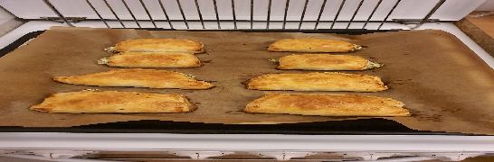

- [ ] 1 dl kuivaa pinaattia  
- [ ] 1 ½ vettä  
- [ ] 200g fetaa  
- [ ] 1 dl cashew pähkinää  
- [ ] 240g [voitaikinaa](puff-paste.md)  
- [ ] ½ tl mustapippuria  
- [ ] 1 muna voiteluun

1. Sekoita kuiva pinaatti veteen ja anna liota noin 5 minuuttia ja valuta siivilässä ylimääräinen neste pois.  
2. Hienonna fetajuusto haarukalla.   
3. Pilko cashew pähkinöitä veitsellä pienemmäksi.  
4. Sekoita kulhossa täytteen aineet keskenään.   
5. Laita taikinaneliöiden keskelle ruokalusikallinen täytettä. Kostuta neliön sivut kevyesti vedellä ja taita neliöt kolmion muotoisiksi pasteijoiksi. Ummista reunat haarukalla painelemalla.  
6. Voitele pasteijat munalla ja pistele ne haarukalla. Paista 225 asteessa uunin alimmalla tasolla 15-20 minuuttia