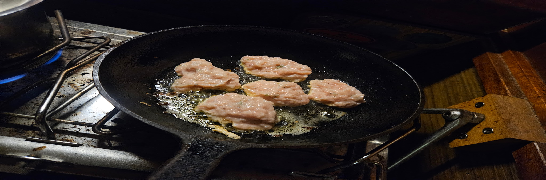

- [ ] 600g kalafilettä, esim. purjekala tai hauki  
- [ ] 1dl Kookosmaitoa  
- [ ] 2 kananmunaa  
- [ ] 2rkl sitruunamehua  
- [ ] tilliä  
- [ ] 2tl mustapippuria  
- [ ] 1tl suolaa

1. Hienonna kala ja tilli blenderissä  
2. Sekoita kalamassaan muna, Kookosmaito, ja mausteet  
3. Muotoile kalamassasta pyöryköitä  
4. Paista pannulla voissa