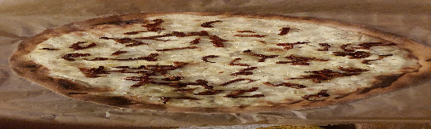

 

- [ ] 200g vehnäjauhoja  
- [ ] 1tl suolaa  
- [ ] 1 rkl     öljyä  
- [ ] 110 ml     vettä  
- [ ] 200 g     ranskankermaa  
- [ ] ½ tl suolaa  
- [ ] 3 ml pippuria  
- [ ] 3 ml muskottipähkinää  
- [ ] 2     sipulia  
- [ ] 50 g     aurinkokuivattua tomaattia

1. Sekoita jauhot, suola öljy ja vesi taikinaksi.   
2. Vaivaa taikinaa kunnes se ei enää tartu käsiin. Lisää jauhoja tarvittaessa.  
3. Anna taikinan kohota rauhassa vähintään 30 minuutin ajan  
4. Sekoita ranskankerma, suola pippuri ja muskottipähkinä.  
5. Pilko sipulit ja aurinkokuivattu tomaatti.  
6. Kauli taikina ohueksi levyksi jauhotetulla pöydällä  
7. Siirrä pohja leivinpaperille tai pizzakivelle  
8. Levitä ranskankermaseos pohjalle ja lisää sipuli.   
9. Paista noin 15 minuuttia ja lisää pilkotut aurinkokuivatut tomaatit  
10. Paista vielä noin 5 minuuttia.  
11. Uunin lämpötila noin 200 astetta