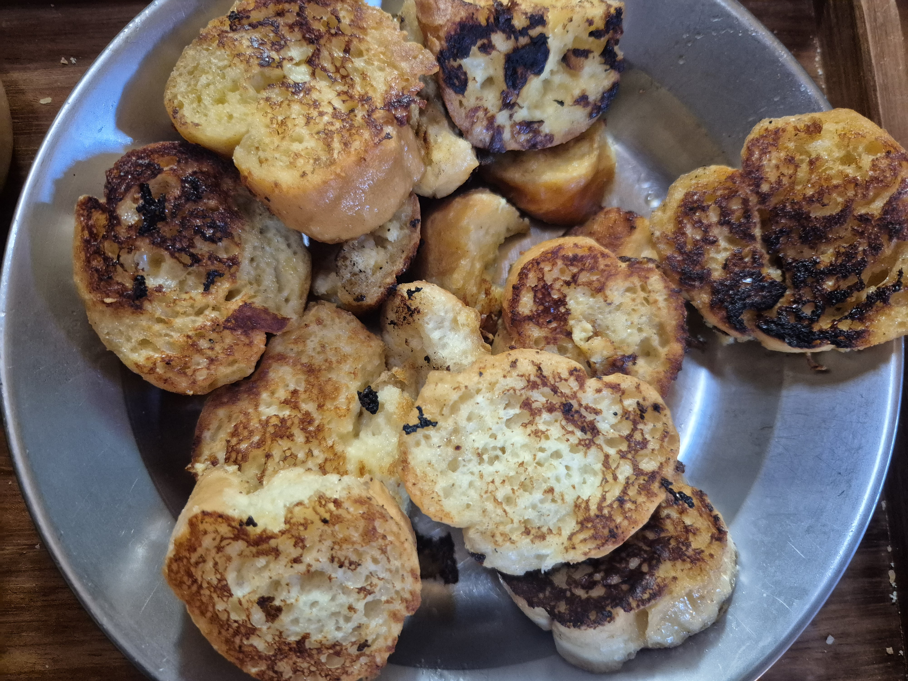

- [ ] 2dl maitoa
- [ ] 1 tl vaniljasokeria
- [ ] 1 munaa
- [ ] Kuiva leipä
- [ ] Voita
- [ ] Hilloa

1. Sekoita munan rakenne rikki. Lisää maito ja vaniljasokeri joukkoon, sekoita.
2. Kasta pullaviipaleet kevyesti muna-maidossa ja paista ne pannulla rasvassa molemmin puolin kauniin ruskeiksi.
3. Nosta lautaselle ja pane kunkin viipaleen päälle lusikallinen hilloa ja syö lämpimänä