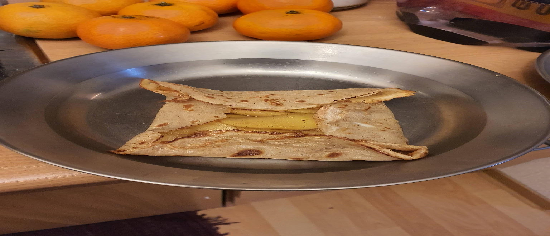

- [ ] 1 dl tattarijauhoa  
- [ ] ¾ dl vehnäjauhoja (täysjyvä)  
- [ ] ½ tl suolaa  
- [ ] 1 munaa  
- [ ] 1 ½ dl maitoa  
- [ ] 1 ½ dl vettä  
- [ ] voita (paistamiseen)

1. Sekoita kuivat aineet keskenään pienessä kulhossa.  
2. Toisessa kulhossa riko munan rakenne.  
3. Lisää maito ja vesi.  
4. Lisää muna, maito ja vesi kuiviin aineisiin ja sekoita tasaiseksi.  
5. Anna taikinan vetäytyä 30 min.  
6. Paista letuista pannulla ohuita lettuja, noin ½ dl per lettu.  
7. Kun lettu käännetään ensimmäisen kerran, lisää suolaiset täytteet. Ja käännä letun reunat keskelle ja tarjoile kuumana suoraan lautaselle.

Täytteinä voi käyttää melkein mitä vaan. Esipaistetu kananmunat ja juustoraaste on hyvä ja helppo aloitus.