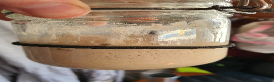

 

- [ ] 4 dl	puolikarkeita vehnäjauhoja  
- [ ] ½ tl	kuivahiivaa  
- [ ] 1 tl suolaa  
- [ ] ½ tl	leivinjauhetta  
- [ ] 1.75 dl vettä  
- [ ] 1rkl rypsiöljya  
- [ ] 2tl sokeria

1. Sekoita sokeri, vesi ja kuivahiiva, anna seistä 15 min  
2. Sekoita kuivat aineet isossa leivontakulhossa.   
3. vaivaa kuivat aineet ja vesi taikinaksi.   
4. Taikina saattaa olla tahmeaa, joten kastele tarvittaessa käsiä kun käsittelet taikinaa. (Mitä vähemmän laitat jauhoja, sen pehmeämpää leivästä tulee)  
5. Anna kohota 90 min  
6. Jaa taikina neljään yhtä suureen osaan. Taittele taikinapalojen reunat palan alle joka suunnasta ja pyörittele sen jälkeen pöytää vasten tai kädessä pyöreäksi palloksi. Jos taikina on tahmeaa, ripsauta päälle hitusen öljyä ja hiero käsin pinnalle. Peitä tiiviisti liinalla tai kelmulla ja anna kohota 15 min.  
7. Valmista taikinan kohotessa valkosipulivoi. Sulata voi. Raasta valkosipuli. Sekoita ainekset kulhossa.  
8. Kauli kaikki taikinapallot jauhoja apuna käyttäen ohuiksi levyiksi. Venytä niitä hieman käsin, jos ne meinaavat vetäytyä kasaan. Jos haluat varmistua, että leipä paistuu myös keskeltä, painele sen pinnalle pieniä kuoppia kevyesti sormin.  
9. Paista leipiä hyvin kuumennetulla kuivalla valurautapannulla muutama minuutti molemmin puolin. Taikinan päälle kuuluisi ilmestyä kuplia paistaessa. Siirrä naan sivuun odottamaan ja valele jokainen leipä voisulalla heti paiston jälkeen. Toista kunnes olet paistanut kaikki leivät.