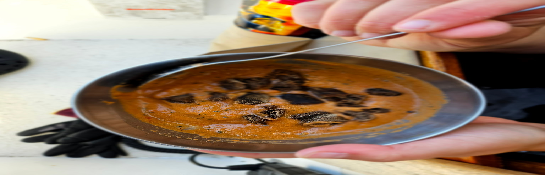

- [ ] 1 tomaattia
- [ ] 1 kourallinen pilkottua paprikaa  
- [ ] ½ kourallinen leipää (sakeuttamiseen)  
- [ ] 1-2rkl sipuli  
- [ ] 1 kynsi valkosipulia  
- [ ] 7cm kurkkua  
- [ ] ½tl mustapippuria  
- [ ] ½tl suolaa  
- [ ] 1rkl oliiviöljyä   
- [ ] Chilihiutaleita (maun mukaan)

Tämä on yhden hengen annos joka mahtuu veneen blenderiin

1. Laita tomaatti ja puolet aineista blenderiin  
2. Aja kunnes nestemäistä  
3. Lisää loput ainekset  
4. Aja kunnes nestemäistä  
5. Tarjoile viileänä, mahdollisesti krutonkien kanssa