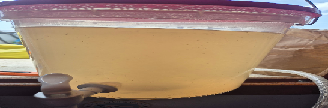

- [ ] 800g tuoretta inkivääriä   
- [ ] 1200g sokeria  
- [ ] 4rkl limettimehua  
- [ ] 1tl shampanjahiivaa  
- [ ] 11l vettä (joista 2.5 litraa keitetty inkiväärin kanssa)

1. Kiehauta 2.5 litraa vettä  
2. Lisää kuorittu ja pilkottu inkivääri veteen.  
3. Kiehuta hiljakseen 15min  
4. Lisää sokerit ja sekoita hyvin  
5. Lisää 8 l kylmää vettä käymisastiaan  
6. Lisää inkivääriliuos paloineen  
7. Lisää limettimehu  
8. Anna jäähtyä 30°C  
9. Ripottele hiiva päälle ja sekoita kevyesti  
10. Anna käydä 4-7 päivää kunnes vesilukossa ei enää pulputtele  
11. Pullota. Lisää pulloon 1rkl sokeria per litra  
12. Anna käydä pullossa 2 päivää ja siirrä viileään.
