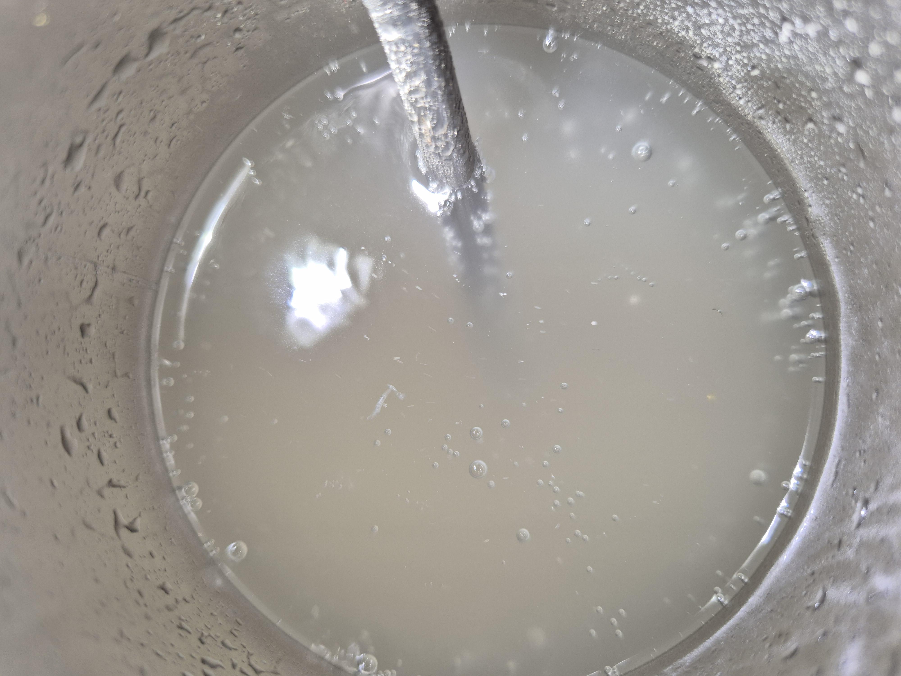

- [ ] 800g tuoretta inkivääriä   
- [ ] 1200g sokeria  
- [ ] 4rkl limettimehua  
- [ ] 1tl shampanjahiivaa
- [ ] 1tl kuivahiivaa
- [ ] 11l vettä (joista 1l keitetty inkiväärin kanssa)

1. Ota shampanjahiiva pois jääkaapista
2. Kuori inkivääri
3. Kiehauta 1l vettä
4. Lisää pilkottu inkivääri veteen
5. Kaada shampanjahiiva kädenlämpöiseen veteen rehydroitumaan
6. Kiehuta hiljakseen 15min  
7. Lisää sokerit ja kuivahiiva kiehuvaan veteen ja sekoita hyvin
8. Lisää 10l kylmää vettä käymisastiaan  
9. Lisää inkivääriliuos paloineen  
10. Lisää limettimehu  
11. Anna jäähtyä 30°C  
12. Lisää rehydroitu hiiva ja sekoita kevyesti  
13. Anna käydä 4-7 päivää kunnes vesilukossa ei enää pulputtele  
14. Pullota. Lisää pulloon 1rkl sokeria per litra  
15. Anna käydä pullossa 2 päivää ja siirrä viileään.

Tähän voi lisätä hunajaa, chiliä, tjsp tuomaan oma lisä-twistinsä.