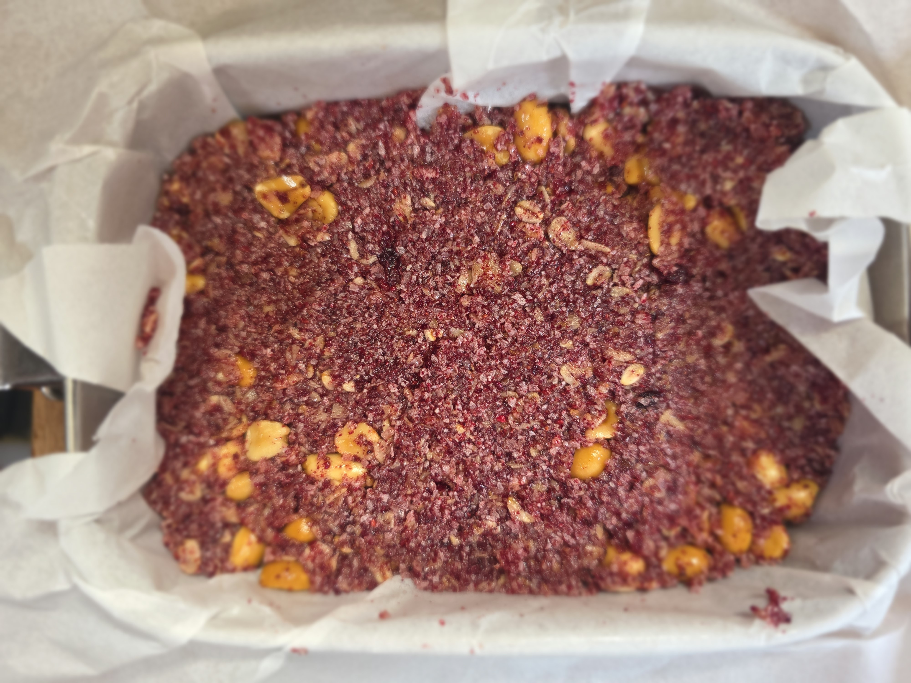

- [ ] 2dl kaurahiutaleita
- [ ] 2dl kookoshiutaleita
- [ ] 0.5dl voita tai kookosöljyä
- [ ] 1dl sokeria
- [ ] 0.5dl hunajaa
- [ ] 1dl maapähkinöitä
- [ ] 0.5dl karpalon kuoria

1. Laita kaura- ja kookoshiutaleet pannulle ja paahda noin 5min aktiivisesti sekoittaen
2. Siirrä seos isoon kulhoon
3. Laita rasva kuumalle pannulle
4. Lisää sokeri ja hunaja pannulle ja sekoita
5. Lisää maapähkinät ja karpalon kuoret kulhoon ja sekoita
6. Siirrää rasva ja sokerit pannulta kulhoon
7. Vuoraa laakea astia leivinpaperilla
8. Pakkaa granola tiiviisti leivinpaperille ja laita jääkaappiin
9. Kun seos on viilentynyt, leikkaa granolasta patukoita
