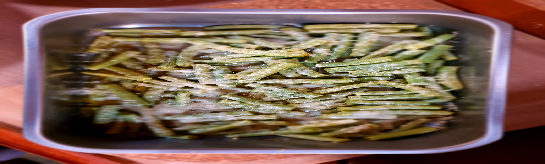

 

- [ ] 400g vihreitä papuja  
- [ ] 1dl oliiviöljyä  
- [ ] 1dl raastettua parmesania  
- [ ] Suolaa  
- [ ] Mustapippuria

1. Lämmitä uuni 200 asteeseen  
2. Leikkaa pavuista päät irti ja paloittele ne noin 3-4cm osiin  
3. Huuhtele pavut  
4. Laita pavut uunivuokaan  
5. Lisää oliiviöljy, suola, ja pippuri ja sekoita hyvin  
6. Tasoita pavut vuoassa ja sirottele parmesan päälle  
7. Laita uuniin 25 minuutiksi  
8. Tarjoile lisukkeena tai riisin kera. Huom\! Vuoassa olevassa oliiviöljyssä on paljon makua\!