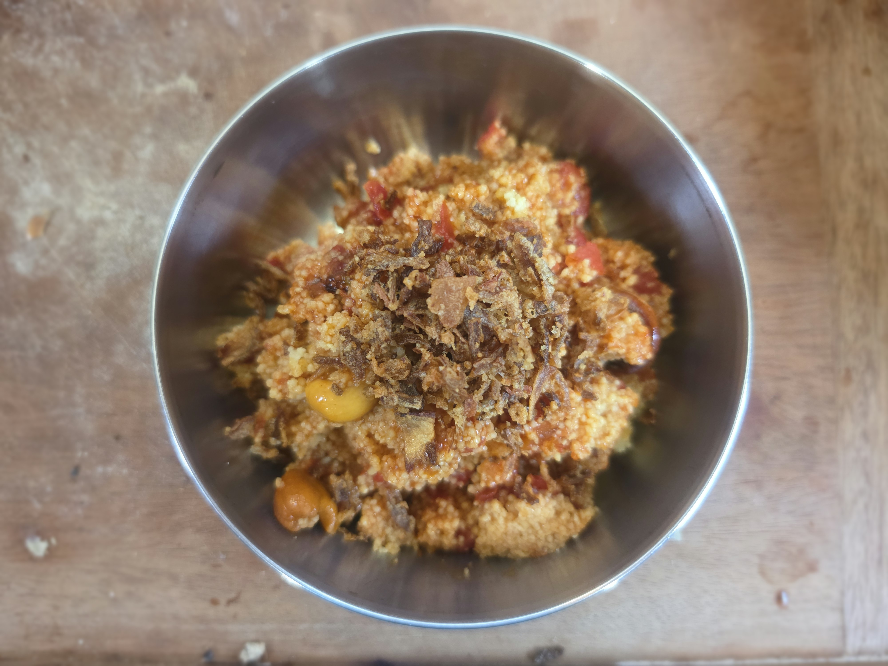

- [ ] 2dl [harissaa](harissa.md)
- [ ] 4 kynttä valkosipulia
- [ ] 1dl cashew-pähkinöitä
- [ ] 1tl suolaa
- [ ] 0.5tl chilihiutaleita
- [ ] oliiviöljyä
- [ ] 400g tomaattimurskaa
- [ ] 2dl kasvislientä
- [ ] 1.75dl couscousia
- [ ] Paistettua sipulia

1. Lisää couscous kuumaan kasvisliemeen ja anna hautua 10min kannen alla
2. Pilko valkosipulit
2. Paista valkosipulia ja cashewtä öljyssä
3. Lisää suola, chilihiutaleet ja harissa
4. Ruskista hetki, lisää sitten tomaattimurska
5. Fluffaa couscous
6. Sekoita kastike couscousiin ja sirottele päälle poistettu sipulia