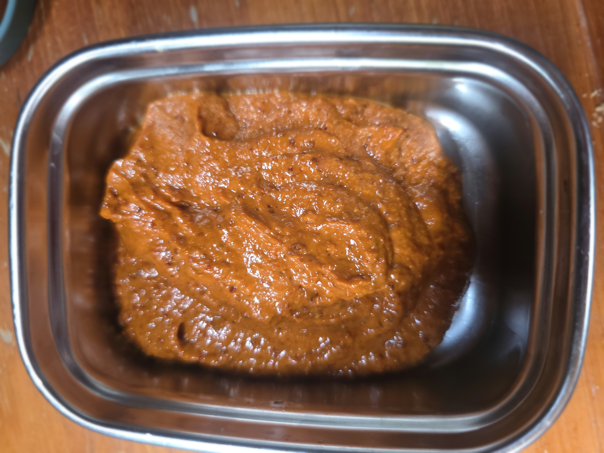

- [ ] 1tl korianterin siemeniä
- [ ] 1tl jeeraa tai kuminajauhetta
- [ ] 1tl savupaprikajauhetta
- [ ] 1tl suolaa
- [ ] 2 cayenne-pippuria
- [ ] 3rkl kuivattua paprikaa
- [ ] 1rkl tomaattipyreetä 
- [ ] 4 kynttä valkosipulia
- [ ] 2rkl sitruunamehua tai yhden limetin mehu
- [ ] 1rkl valkoviinietikkaa
- [ ] 4rkl oliiviöljyä
- [ ] 0.5dl vettä

1. Laita aineet blenderiin ja sekoita

Tästä tulee noin 2dl harissaa.
