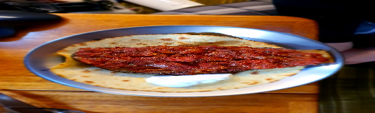

 

- [ ] 1 isohko munakoiso  
- [ ] 1 sipuli pilkottuna  
- [ ] 1dl oliiviöljyä  
- [ ] 2 kynttä valkosipulia murskattuna  
- [ ] 400g tomaattimurskaa  
- [ ] 1rkl persijaa  
- [ ] 5ml minttua  
- [ ] 2ml chilijauhetta  
- [ ] 2ml sokeria  
- [ ] 2rkl sitruunamehua  
- [ ] Suolaa  
- [ ] Mustapippuria

1. Leikkaa munakoisosta pää irti ja halkaise se kahtia pituussuunnassa  
2. Tee puolikkaide  sisäpuolella kolme pituussuuntaista noin 2-3cm syvyistä viiltoa  
3. Lämmitä 1dl oliiviöljyä paistinpannulla  
4. Lisää munakoiso ja paista leikattu puoli alaspäin kunnes ruskistunut  
5. Käännä ja paista kuoripuolta muutaman minuutin ajan  
6. Poista öljy ja laita munakoisot valumaan talouspaperi päälle ainakin 15min ajaksi  
7. Kuullota sipulit pienessä määrässä oliiviöljyä  
8. Lisää valkosipuli, tomaatit, persilja, suola, chilijauhe, ja pippuri  
9. Keitä kokoon kunnes paksua (ei nestettä, voi vetää laatalla ja kastike ei valu). Lisää minttu ja laita sivuun  
10. Lämmitä uuni 180 asteiseksi  
11. Asettele munakoisot uunivuoalle. Levitä munakoison viiltoja ja täytä ne kastikkeella  
12. Sirottele sokeri, sitruunamehu, ja hieman oliiviöljyä päälle  
13. Paista uunissa kunnes pehmeitä, noin 40mib  
14. Tarjoile leivän tai riisin kera