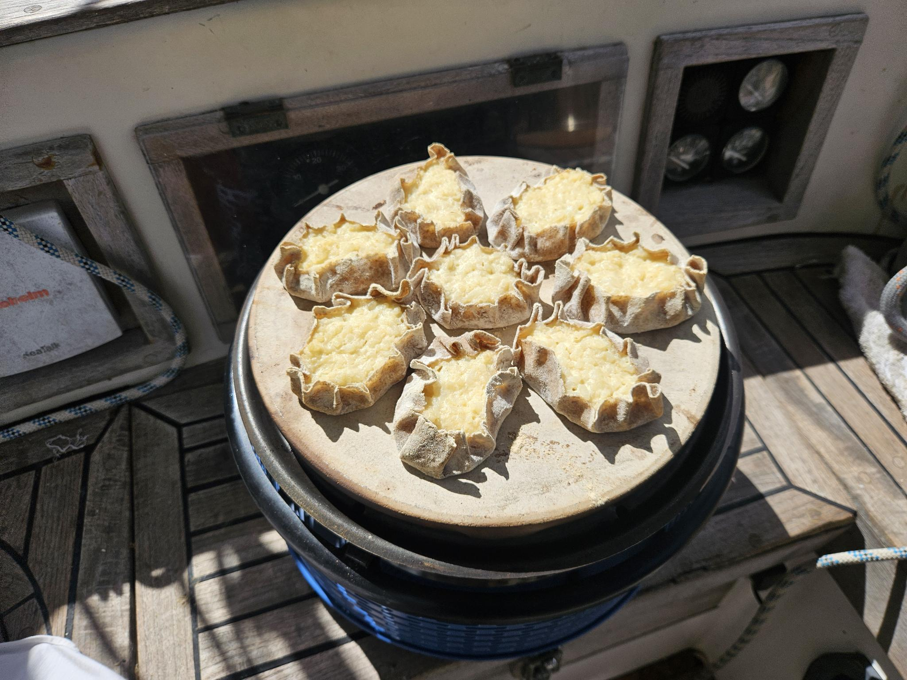

Kuoritaikina:  
- [ ] 1½ dl vettä  
- [ ] 1 rkl öljyä  
- [ ] 3/4 tl suolaa  
- [ ] 3 dl ruisjauhoja  
- [ ] 1 dl vehnäjauhoja

Täyte:
- [ ] 3 dl vettä  
- [ ] 2 dl riisiä  
- [ ] 7 dl maitoa  
- [ ] 1 tl suolaa  
- [ ] 1 kananmunaa

1. Sekoita kiehuvaan veteen riisi ja keitä 10 minuuttia.  
2. Lisää maito hiljalleen ja anna puuron kiehua hiljalleen 30 minuuttia välillä pohjaa pitkin sekoittaen. Jätä täyte hautumaan kannen alle 10 minuutiksi.  
3. Mausta valmis puuro suolalla ja jäähdytä se.  
4. Sekoita jäähtyneeseen puuroon muna.  
   Piirakoiden valmistaminen:  
5. Sekoita  kylmään veteen, öljy,  suola ja jauhot puuhaarukalla. Vaivaa taikina sileäksi ja kiinteäksi. 
6. Ripottele pöydälle ruis- ja vehnäjauhoseosta ja kaada taikina jauhojen päälle. Kaulitse taikinasta noin 1/2 cm:n paksuinen levy.  
7. Painele levystä juomalasilla kakkaroita.  
8. Aseta kakkarat kuuden kappaleen pinoihin, etteivät ne kuivu. Peitä pinot muovipussilla tai kulholla.  
9. Kaulitse kakkarat piirakkapulikalla ohuiksi pyöreiksi tai soikeiksi kuoriksi. Lado kuoret päällekkäin ja ripottele ruisjauhoja väliin. Peitä kuoripinot muovipussilla. Täytä kuoret mahdollisimman pian, jotta ne eivät tartu kiinni toisiinsa.  
10. Ota kuoret leivinpöydälle, levitä lusikallinen täytettä kuoren keskelle (1 cm paksuinen kerros täytettä) ja jätä kuoren reunoilta noin 1 cm tyhjää tilaa.  
11. Käännä vastakkaiset reunat täytteen päälle ja rypytä piirakat etusormilla.  
12. Siirrä piirakat uunipellille leivinpaperin päälle.  
13. Paista piirakoita 275-300°C lämmössä noin 15 minuuttia.  
14. Lado kuumat piirakat kulhoon päällekkäin ja peitä leivinpaperilla ja liinalla.