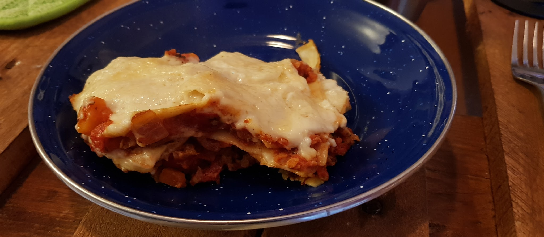

 

Bolognese-kastike:  
- [ ] 1 rkl oliiviöljyä
- [ ] 1 sipuli
- [ ] 1 porkkanaa
- [ ] 2 kynttä valkosipulia
- [ ] ½ rkl basilikaa
- [ ] ½ rkl oreganoa
- [ ] ½ rkl timjamia
- [ ] laakerinlehti
- [ ] ½ tl chilihiutaleita
- [ ] 125ml soijarouhetta
- [ ] 1 rkl soijakastiketta
- [ ] 125ml kasvislientä
- [ ] 80g tomaattipyrettä
- [ ] 400g tomaattimurskaa

Béchamel-kastike:  
- [ ] 1.5 rkl voita
- [ ] 3 rkl vehnäjauhoja
- [ ] 5dl maitoa  
- [ ] 1.5dl juustoraastetta

Lasagne:  
- [ ] 7 kpl lasagnelevyä
- [ ] 1dl juustoraastetta

Bolognese-kastike:
1. Lämmitä oliiviöljy pannulla keskilämmöllä
2. Lisää sipuli ja porkkana, paista kunnes pehmeitä
3. Lisää suola ja pippuri
4. Lisää yrtit ja chilihiutaleet ja sekoita
5. Lisää valkosipuli ja paista hetki
6. Lisää soijarouhe ja sekoita hyvin
7. Lisää soijakastike
8. Kostuta soijarouhe kasvisliemellä, anna kiehahtaa
9. Lisää tomaattipyre ja sekoita
10. Lisää tölkkitomaatit
11. Anna hautua pienellä lämmöllä 5-7min

Béchamel-kastike:  
1. Sulata voi kattilassa ja sekoita jauho siihen
2. Lisää maito samalla vispaten
3. Keitä 3min välillä sekoittaen
4. Mausta suolalla ja pippurilla
5. Sekoita juustoraaste

Lasagne:
1. Levitä béchamel-kastikettä vuoan pohjalle
2. Rakenna kolme kerrosta lasagne-levyjä vuorotellen bolognese-kastikkeen ja béchamel-kastikkeen kanssa. Varmista että jokainen lasagne-levy on kastikkeen peitossa
3. Levitä loppu béchamel-kastike päälle
4. Laita päälle juustoraaste
5. Paista uunin keskilämmöllä noin 35min