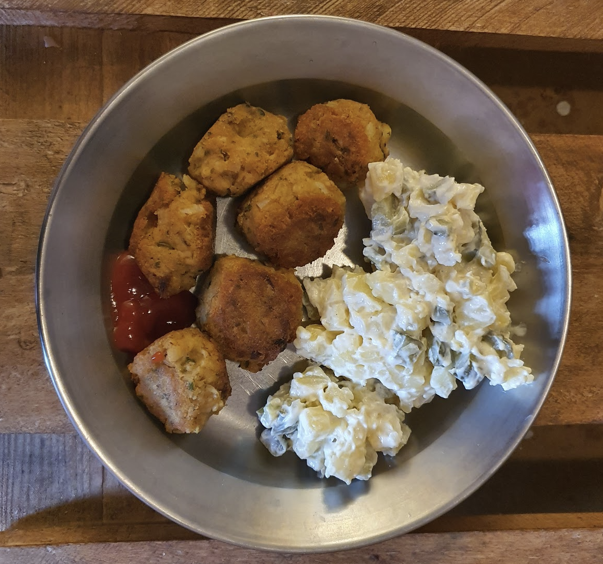

- [ ] 2.5dl punaisia linssejä  
- [ ] 1 sipuli
- [ ] 1 munaa  
- [ ] 1 rkl persiljaa  
- [ ] 1 tl chilijauhetta  
- [ ] 2 tl valkosipulijauhetta  
- [ ] ½ tl chilihiutaleita  
- [ ] 1 tl jeeraa (käsin muussattuina)
- [ ] 1 dl kaurahiutaleita  
- [ ] mustapippuria (maun mukaan)
- [ ] suolaa (maun mukaan) 
- [ ] oliiviöljyä

1. Keitä linssejä 12min painekattilassa (750 ml vettä,, mukaan 2 maustemittaa suolaa, kuminaa,  1 rkl oliiviöljyä, 1 laakerinlehti)  
2. Siivilöi linssit  
3. Hienonna sipuli erittäin pieneksi
4. Sekoita muut aineet kulhossa  
5. Lisää linssit ja sekoita puukauhalla. Jos seos on liian kuivaa lisää oliiviöljyä. Jos liian märkää lisää kaurahiutaleita  
6. Anna seoksen istua 10 minuuttia  
7. Tee seoksesta kostein käsin pieniä noin 1 rkl pyöryköitä  
8. Lämmitä uuni 100°C asteeseen  
9. Ruskista pyörykät öljytyllä pannulla niin 2-3min per puoli  
10. Pidä pyörykät lämpimänä uunissa  
11. Tarjoile esim. perunasalaatin tai perunamuusin kanssa