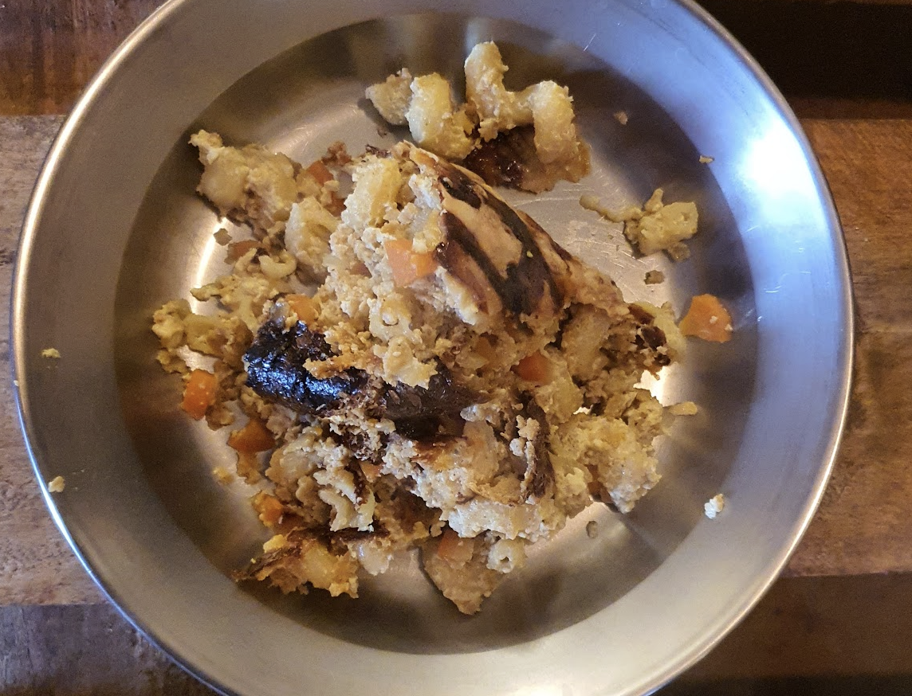

- [ ] 1 rkl oliiviöljyä  
- [ ] 1 sipuli  
- [ ] 1 porkkanaa 
- [ ] 1 tl curryjauhetta  
- [ ] 1 tl paprikajauhetta  
- [ ] ¾ tl suolaa  
- [ ] ½ tl valkopippuria  
- [ ] 150 ml soijarouhetta  
- [ ] 2 rkl soijakastiketta  
- [ ] 150 ml kasvislientä   
- [ ] 5 dl maitoa  
- [ ] 2 munaa (3 korviketta)  
- [ ] 3 dl makaronia  
- [ ] juustoraastetta
- [ ] Ketsuppia

1. Lämmitä uuni 200 asteeseen  
2. Lämmitä keskilämmöllä isolla pannulla oliiviöljyä. Lisää pilkottu sipuli ja pilkotut porkkanat ja anna hautua noin 5 minuuttia kunnes porkkanat ja sipuli alkavat pehmetä.
3. Lisää mausteet pannulle. Jos seos näyttää kuivalta, lisää hieman oliiviöljyä.
4. Lisää kuiva soijarouhe ja sekoita tasaiseksi sipulin, porkkanoiden ja mausteiden kera. Lisää soijakastike ja sekoita.
5. Lisää kasvisliemi pannulle. Anna kiehua muutama minuutti. Ota pannu sitten liedeltä
6. Riko munat ja sekoita maidon kanssa
7. Lisää makaronit, pannulla olevat ainekset, ja muna-maitoseos uunivuokaan
8. Laita uunin alatasolle tunniksi
9. Sekoita pari kertaa ensimmäisen 25min aikana, päällystä sitten juustolla
10. Tarjoile ketsupin kera