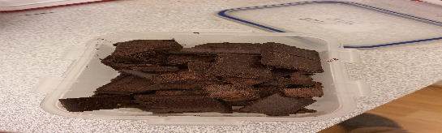

 

- [ ] 2 dl sokeria  
- [ ] 2 munaa  
- [ ] 1 dl vettä  
- [ ] 150g voita (sulatettuna)  
- [ ] 3dl vehnäjauhoja  
- [ ] 2tl leivinjauhetta  
- [ ] 2tl vaniljasokeria  
- [ ] 1tl neilikkaa  
- [ ] 50 g suklaata (murustettuna)
Kuorrutus:   
- [ ] 225g tomusokeria  
- [ ] 1/2dl voita  
- [ ] 1/2dl kahvia (vahvaa)
- [ ] 2tl vaniljasokeria

1. Vatkaa sokeri ja munat vaahdoksi  
2. Lisää vesi  
3. Lisää sulatettu voi  
4. Lisää sekoitetut kuivat aineet  
5. Lisää suklaa  
6. Kaada leivinpaperilla vuorattuun vuokaan ja paista 225 asteessa 20 minuuttia  
7. Vatkaa kuorrutuksen aineet sileäksi ja levitä sitten jäähtyneelle levyllä ja leikkaa leivoksiksi