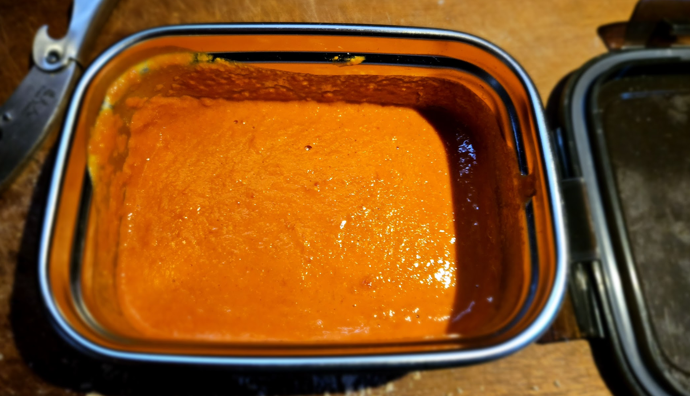

 

- [ ] 4 kynttä valkosipulia   
- [ ] 1 paprika (pilkottuna)  
- [ ] 1 rkl punaviiniä  
- [ ] ½ rkl valkoviinietikkaa  
- [ ] 1 tl suolaa
- [ ] 1 tl kuminaa 
- [ ] 2 tl savupaprikajauhetta
- [ ] ½ dl oliiviöljyä   
- [ ] Kuiva leipä (seoksen suurustamiseen. Riittävästi, jotta kastike ei valu leivänpalalta pois)

1. laita kaikki ainekset tehosekoittimeen ja surruta tasaiseksi paksuhkoksi seokseksi