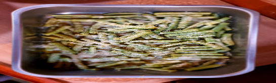

 

- [ ] 1 munakoiso  
- [ ] Voita  
- [ ] 2 \- 4 jauhoista perunaa , esim. Rosamunda  
- [ ] Soijakastike  
- [ ] 1 rkl oliiviöljyä  
- [ ] 1 sipuli  
- [ ] 2 valkosipulin kynttä  
- [ ] 1 tl pippurisekoitusta  
- [ ] ¾ tl suolaa  
- [ ] 1 tl sokeria  
- [ ] 1 rkl oreganoa  
- [ ] ripaus kanelia
- [ ] 150 ml soijarouhetta  
- [ ] 2 rkl soijakastiketta  
- [ ] 150 ml kasvilientä  
- [ ] 400 g tomaattimurska  
- [ ] Juustokastike  
- [ ] 1 dl vehnäjauhoja  
- [ ] 6 dl maitoa  
- [ ] 2 ½ dl Mozzarella raastessa  
- [ ] ½ tl suolaa  
- [ ] ripaus muskottia  
- [ ] Lisää halutessasi tomaattikastikkeeseen 1 dl punaviiniä  
- [ ] Pinnalle mozzarella raastetta

1. Lämmitä keskilämmöllä isolla pannulla oliiviöljyä. Lisää pilkottu sipuli anna hautua noin 5 minuuttia kunnes sipuli alkaa pehmetä.
2. Lisää kuivat mausteet pannulle. Jos seos näyttää kuivalta, lisää hieman oliiviöljyä. Sekoita murskattu valkosipuli joukkoon hyvin sekoittaen..
3. Lisää kuiva soijarouhe ja sekoita tasaiseksi sipulin, porkkanoiden ja mausteiden kera. Lisää soijakastike ja sekoita.
4. Lisää kasvisliemi pannulle. Anna kiehua muutama minuutti.
5. Lisää tomaattimurska ja sekoita. 
6. Laita tomaattikastike sivuun
7. Valmista juustokastike: Mittaa jauhot kattilaan. Kaada joukkoon maito muutamassa erässä, sekoita vispilällä aina välillä tasaiseksi. Anna kiehua hiljalleen pari min. Lisää juustoraaste. Sekoita ja kuumenna kunnes juusto sulaa. Mausta.
8. Lado voideltuun uunivuokaan kerroksittain tomaattikastiketta, munakoiso- ja perunaviipaleita ja juustokastiketta. Ripottele pinnalle juustoraaste.
9. Kypsennä uunin alaosassa 175 asteessa 45 \- 50 min. Tarkista kypsyys. Nosta vuoka uunista. Peitä alumiinifoliolla ja anna makujen tasoittua hetken ennen tarjoilua.

   Joskus munakoison maussa voi olla kitkeryyttä. Sitä voi poistaa suolakäsittelyllä. Levitä viipaleet leivinpaperille kahteen kerrokseen. Ripottele pinnalle ja väliin suolaa. Anna suolautua hetki. Pyyhi pinnalle noussut neste talouspaperilla. Miedonmakuisia, pieniä munakoisoja ei tarvitse "itkettää".