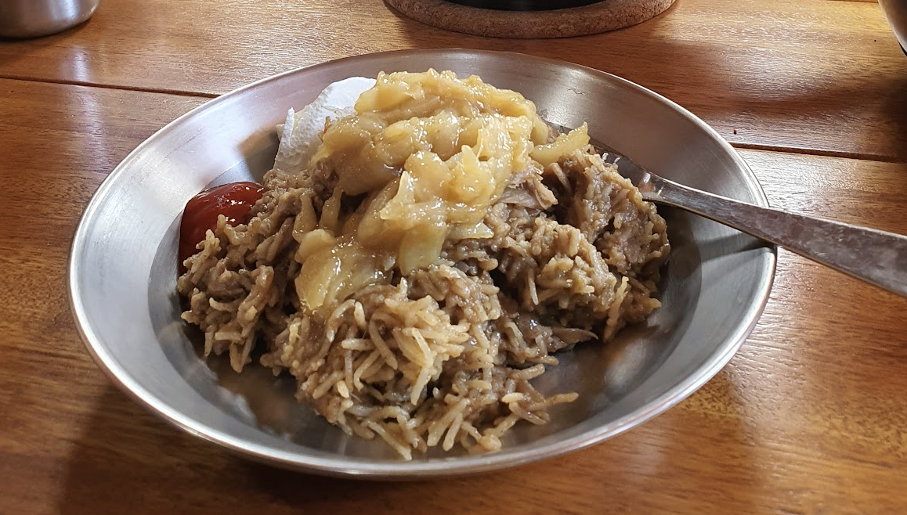

 

- [ ] 1 dl oliiviöljyä  
- [ ] 4 sipuli 
- [ ] 4-6 kynttä valkosipulia  
- [ ] 1 rkl kuminaa  
- [ ] 1 tl maustepippuria  
- [ ] ¼  tl neilikkajauhe  
- [ ] 2 tl suolaa  
- [ ] 6 dl kasvislientä  
- [ ] 2.5 dl riisiä  
- [ ] 2.5 dl ruskeita linssejä  
- [ ] Jugurttia tai sriracha kastiketta päälliseksi

1. Pilko sipulista ohuita renkaita ja paista niitä kattilassa ½ dl oliiviöljyä ja suolan kanssa. Paista sipuleita miedolla lämmöllä ja sekoita usein noin tunnin ajan tai kunnes sipulit ovat kullanruskeita ja karamellisoituneita. Laita puolet sipulista syrjään.  
2. Lisää valkosipuli, kumina, maustepippuri, loput suolasta ja neilikka. Pasita sipulin kanssa noin minuutin ajan.   
3. Lisää kasvisliemi ja loput oliiviöljystä ja sekoita kunnolla  
4. Lisää riisi ja linssit kattilaan. Peitä kattila kannella ja kasvata lieden lämpö kovaksi ja anna kiehuta seos. Kun seos on kiehahtanut, käännä hella taas pienelle ja anna hauduta 30 minuutin ajan. Tämän jälkeen anna seoksen jäähtyä kansi päällä 10 minuuttia.  
5. Ennen tarjoilua sekoita ruoka vielä kerran ja tarjoile aiemmin sivuun laittamasi karamellisoidun sipulin kera.