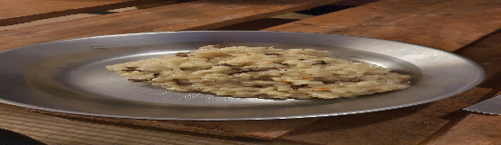

- [ ] 10g kuivattuja sieniä   
- [ ] 3dl risotto-riisiä  
- [ ] 6dl kasvislientä  
- [ ] 1 sipuli  
- [ ] 1 rkl oliiviöljyä  
- [ ] 1 dl valkoviiniä
- [ ] 1dl parmesania tai pecorinoa  
- [ ] 1 rkl voita  
- [ ] ½ tl suolaa  
- [ ] ½ tl mustapippuria

1. Liota sienet kolmessa desissä lämmintä vettä  
2. Pilko sipulit  
3. Valmista kasvisliemi ohjeen mukaan  
4. Kuullota sipulit kattilan pohjalla oliiviöljyssä. (Sipulien tulee olla läpinäkyviä). Sekoita joukkoon suola.  
5. Lisää riisi kattilaan ja paista kunnes riisi on läpikuultavaa  
6. Lisää viini kattilaan ja raaputa kaikki ainekset irti kattilanpohjasta paistolastalla 
7. Lisää kasvisliemi ja sienet liotusvesineen
8. Paista painekattilassa 7 minuuttia  
9. Päästä paineet kattilasta ja sekoita risottoa 30 sekuntia  
10. Sekoita voi, juustoraaste ja mustapippuri risottoon  
11. Jos kattilassa näkyy nestettä, sekoita kunnes se on risoton joukossa

Tavallisella kattilalla riisi-neste-suhde 1:3, painekattilalla 1:2.
Myös punaviini toimii.