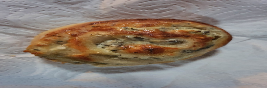

**Taikina**  
- [ ] 2 ½ dl vettä  
- [ ] 25 g hiivaa  
- [ ] 50 g parmesaania raastettuna  
- [ ] 1 rkl hunajaa  
- [ ] ½ tl suolaa  
- [ ] 6 dl vehnäjauhoja  
- [ ] ½ dl oliiviöljyä  
**Täyte**  
- [ ] 1 dl  kuivattuja suppilovahveroita  
- [ ] 1 sipuli  
- [ ] ½ rkl oliiviöljyä  
- [ ] ¼ tl suolaa  
- [ ] 1rs maustamatonta tuorejuustoa  
- [ ] 2 valkosipulinkynttä  
- [ ] 1 rkl  basilikaa  
- [ ] 75 emmental juustoraastetta  
**Pinnalle**  
- [ ] kananmuna

1. Valmista taikina. Murenna ja sekoita hiiva kädenlämpöiseen maitoon. Sekoita nesteeseen hienoksi raastettu parmesaani, hunaja ja suola. Lisää spelttijauhot ja vähitellen vehnäjauhoja. Alusta kimmoisaksi taikinaksi. Lisää alustuksen loppuvaiheessa öljy. Anna taikinan kohota peitettynä lämpimässä paikassa kaksinkertaiseksi, noin 45 minuuttia.  
2. Valmista täyte. Laita sienet likoamaan. Hienonna valkosipulinkynnet, valuta sienet  ja sekoita molemmat tuorejuuston joukkoon. Lisää kuivattu basilika tässä vaiheessa tuorejuuston joukkoon  
3. Kaada taikina jauhotetulle työtasolle ja vaivaa ilmakuplat pois. Kauli taikina levyksi (noin 25 cm × 45 cm). Levitä tuorejuusto levyille ja ripottele päälle tuorejuustotahna  ja juustoraaste. Kääri levyt pitkältä sivulta tiukaksi rullaksi. Leikkaa rullat noin 2 cm:n paksuisiksi paloiksi ja asettele palat leivinpaperin päälle uunipelleille. Jätä kohoamisvaraa.  
4. Anna puustien kohota peitettynä noin puoli tuntia. Voitele puustit munalla..  
5. Paista sienipuusteja 200-asteisen uunin keskitasolla 15–20 minuuttia, kunnes ne ovat kauniin kullanruskeita.