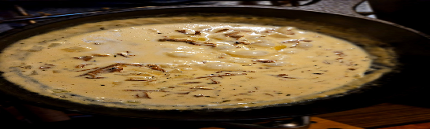

 

- [ ] 1dl kuivattuja sieniä  
- [ ] 1/2dl sherryä  
- [ ] 200ml kermaa  
- [ ] voita  
- [ ] 1 sipuli pilkottuna  
- [ ] 5ml mustapippuria  
- [ ] 5ml timjamia

1. Liota sieniä 30min lämpimässä vedessä (noin 5dl vettä per 1dl sieniä)  
2. Kaada sienet vesineen pannulle  
3. Hauduta kunnes vesi on haihtunut suurimmaksi osaksi. Lisää sherryä hiljalleen 
4. Lisää voi ja pilkottu sipuli ja paista kunnes läpikuultavaa  
5. Keitä spaghetti
6. Lisää kerma, timjami ja mustapippuri, hauduta kunnes saavuttaa halutun paksuuden. Lisää suolaa tarpeen mukaan  
7. Sekoita spaghetti kastikkeen kanssa ja tarjoile