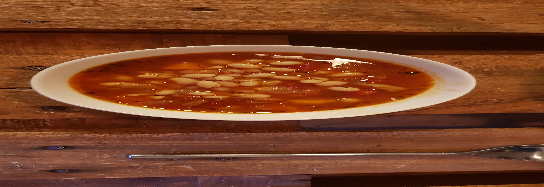

 

- [ ] 2.5dl valkoisia papuja, liotettuina  
- [ ] 400g murskattuja tomaatteja  
- [ ] 1 sipuli, pilkottuna  
- [ ] 4 kynttä valkosipulia, pilkottuna  
- [ ] 2 porkkanaa, pilkottuna  
- [ ] 5dl kasvislientä  
- [ ] ½ rkl timjamia  
- [ ] ½ rkl kuminaa  
- [ ] 1 tl chilihiutaleita  
- [ ] 1 tl soijakastiketta  
- [ ] 1 laakerinlehti  
- [ ] Mustapippuria  
- [ ] Suolaa  
- [ ] 1 rkl oliiviöljyä

1. Laita pavut kokoamaan edellisenä päivänä  
2. Paista sipuli, valkosipuli ja porkkanat oliiviöljyssä kattilan pohjalla kunnes pehmeitä  
3. Lisää mausteet ja paista hetki  
4. Lisää pavut, tomaatit, liemi, soijakastike ja laakerinlehti. Anna kiehahtaa. Hauduta 90 minuutin ajan (45min painekattilassa)  
5. Poista laakerinlehti kun pavut ovat silkkisen pehmeitä.  
6. Maista ja lisää suolaa tarvittaessa